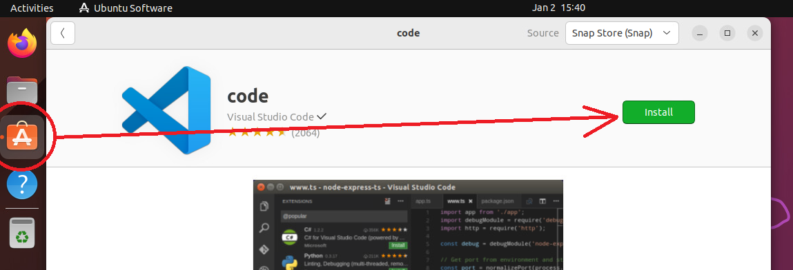
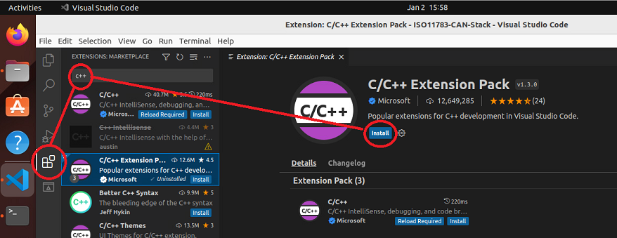
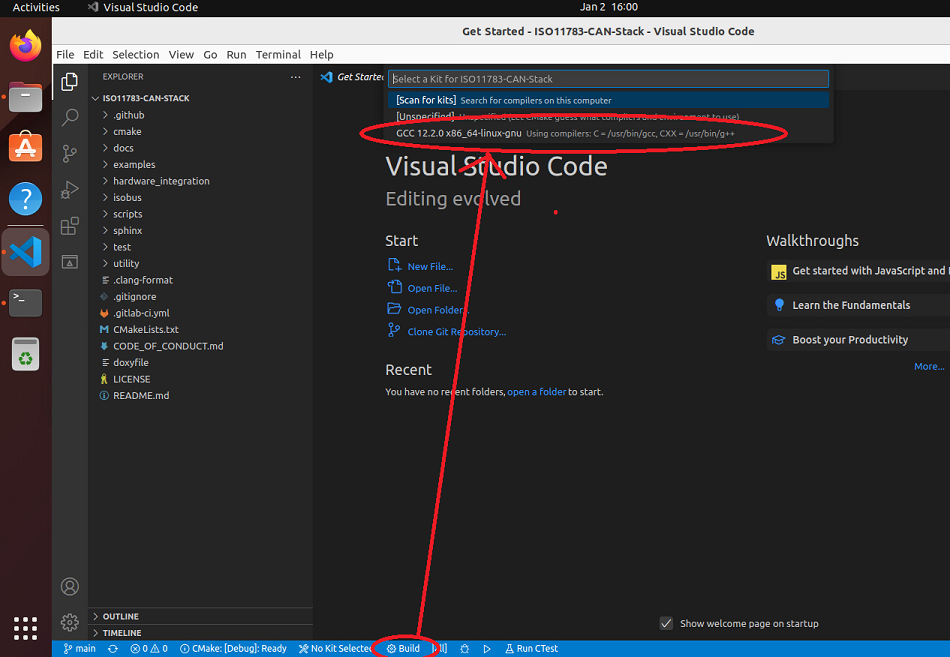
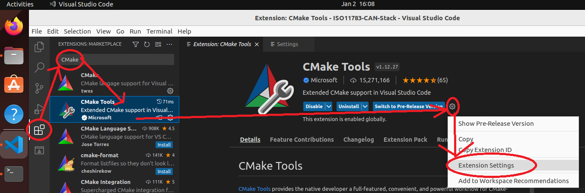
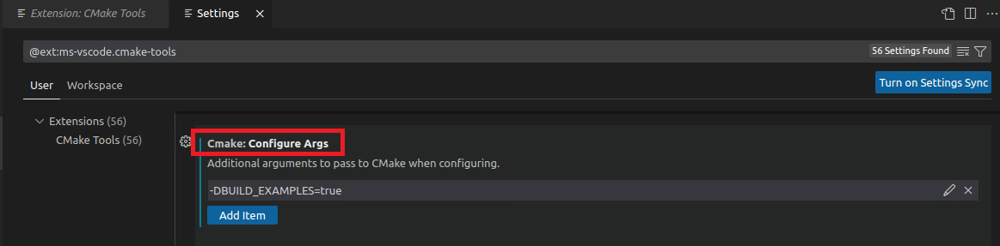
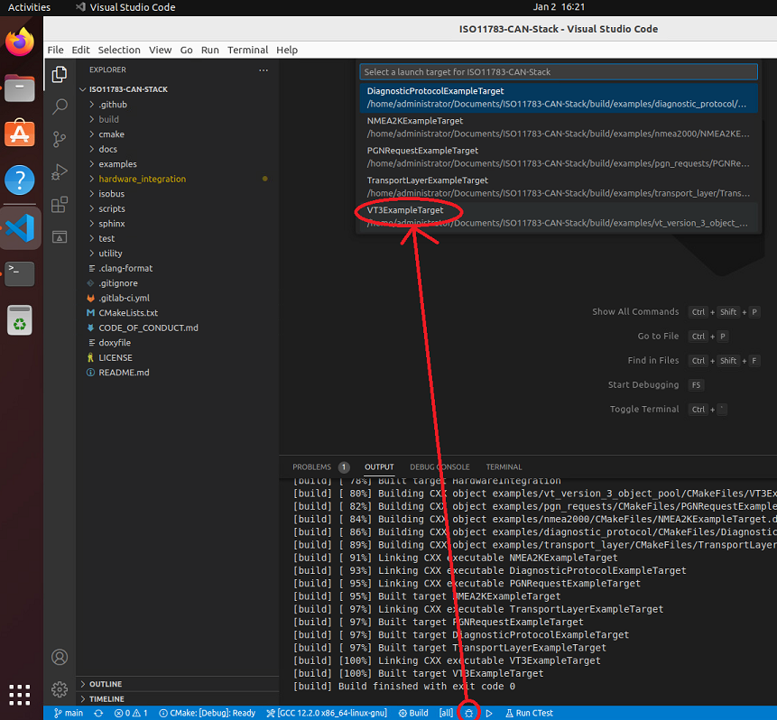

# Contributing to ISOBUS++

We accept public contributions that follow our code of conduct, pass all automated pre-merge checks, and pass a manual code review by a repo maintainer.

## What Are The Requirements?

Our style rules and PR reviews are based loosely on Autosar's `Guidelines for the use of the C++14 language in critical and safety-related systems` and `MISRA C++` suggestions and try to ensure the highest quality possible.

* Contributions must follow the style defined in our `.clang-format` and `.cmake-format` files. You can ensure you pass this check by running `find . -iname *.hpp -o -iname *.cpp | xargs clang-format -i` and `find . -name CMakeLists.txt | xargs cmake-format -i` at the root of the repo before submitting your PR.
* Contributions should follow these additional style requirements, which will be checked in code reviews.
	* Function names `snake_case`
	* Variables `camelCase`
	* Constant values `CAPITALIZED_SNAKE`
	* Constants on the left in `==` and `!=` checks. Like this: `if (5 == value)` NOT `if (value == 5)`. This is to prevent accidentally omitting an `=` in the operator and creating a runtime bug.
	* Copyright notice must be included in each file.
	* `NULL` should not be used when `nullptr` can be used
	* Explicit namespacing should be used for accessing namespaces outside of our namespace `isobus`, especially for the standard library `std::`
	* No `using namespace` directives are allowed in header files
	* Constructors with a single parameter shall be marked `explicit`
	* Where possible, append `const` to functions that do not modify class member variables
	* Where possible, delcare variables as `constexpr` if their value can be determined at compile time
	* Only those characters specified in the C++ Language Standard basic source character set shall be used in the source code except within the text of a wide string.
	* In general, prefer C++ over C, though exceptions may be granted if needed
	* This list of style items is not exhaustive, and some best practices such as include guards will also be checked in our PR reviews.
* Doxygen should compile with no warnings when run at the root of the project with the command `doxygen doxyfile`
* Absolutely no code shall be added that is under a more strict license than MIT or which has not had conditions met to be distributed under our license
* Builds must pass the compilation github action
* C++14 or earlier is required to help provide the maximum compatibility to all "modern" compilers

These rules are not meant to be exclusionary or difficult to follow. Our only goal is to maximize the code quality in the project. It's also OK if you miss some of these items in your PR on your first or second try, we'll help you get your PR up to this standard. We want your contibutions!

## Setting up a Development Environment With GUI

You can easily set up a linux PC or virtual machine to develop for this project!

We suggest using Ubuntu, Debian, RHEL, or Raspbian, but other systems may also work. Windows development is supported with PEAK CAN hardware devices.

### Install The Prerequisites

Linux:

Install the following tools:

* git
* cmake
* build-essential (gcc and g++ or any modern CXX compiler)
* doxygen (optional)
* graphviz (optional)
* clang-format (optional)

Install your favorite IDE if you want. We suggest Visual Studio Code because it's easy and we will use it in the remainder of this guide.

VS Code can be installed via the snap store, or by downloading it from [Microsoft](https://code.visualstudio.com/Download).



Clone the repo:

```
git clone https://github.com/ad3154/ISO11783-CAN-Stack.git
```

Then, open it in Code by clicking `File -> Open Folder`.

Install the C++ extension pack in Code.



Then, build the project by clicking the "build" button and select a compiler.



This will compile the static libraries that are the core of this project.

## Building Examples

If you want to build the examples and debug with them, you'll need to tell that to CMake.

Go into the CMake Tools extension settings, and add a new configure-time argument for `-DBUILD_EXAMPLES=ON`. You may need to scroll down a ways to get to it.





Then recompile with the same "build" button as before. Now the examples will be built.

Now, you can easily start debugging by clicking on the launch debugger button and selecting the target you want to debug.



### A Note on Integration

If you are integrating this library with your project, you may need to adapt these instructions to fit your project, but this guide should be enough to get you going with the [example projects](https://github.com/ad3154/ISO11783-CAN-Stack/tree/main/examples).
