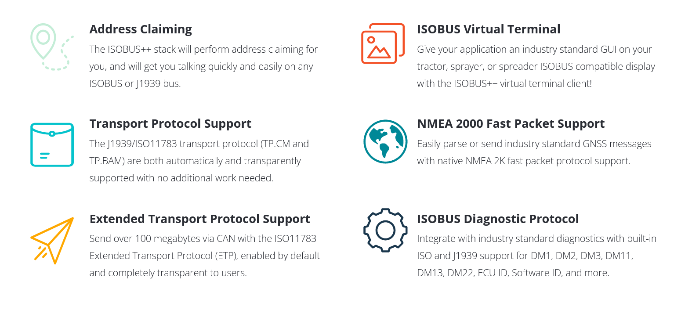
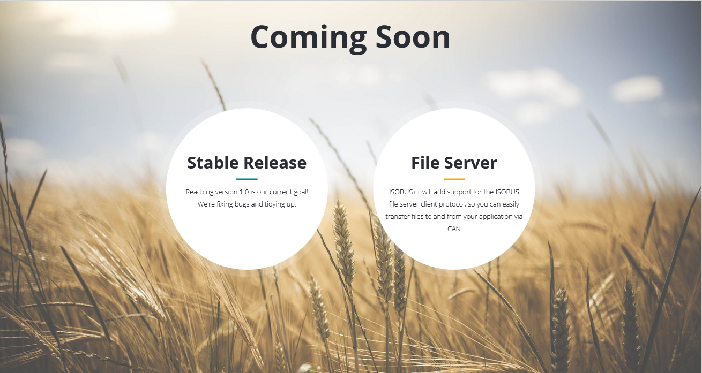

## Getting Started

Check out the [tutorial website](https://delgrossoengineering.com/isobus-tutorial/index.html) for information on ISOBUS basics, how to download this library, and how to use it. The tutorials contain in-depth examples and explanations to help get your ISOBUS or J1939 project going quickly.

## Compilation

This library is compiled with CMake.

```
cmake -S . -B build
cmake --build build
```

A default CAN driver plug-in will be selected for you based on your OS, but when compiling you can explicitly choose to use one of the natively supported CAN drivers by supplying the `CAN_DRIVER` variable.

* `-DCAN_DRIVER=SocketCAN` Will compile with Socket CAN support (This is the default for Linux)
* `-DCAN_DRIVER=WindowsPCANBasic` Will compile with windows support for the PEAK PCAN drivers (This is the default for Windows)
* `-DCAN_DRIVER=TWAI` Will compile with support for the ESP TWAI driver
* `-DCAN_DRIVER=MCP2515` Will compile with support for the MCP2515 CAN controller

Or specify multiple using a semicolon separated list: `-DCAN_DRIVER="<driver1>;<driver2>"`

If your target hardware is not listed above, you can easily integrate your own hardware by [implementing a few simple functions](https://github.com/ad3154/ISO11783-CAN-Stack/tree/main/hardware_integration#writing-a-new-can-driver-for-the-stack).

## Examples

There are build in examples. By default, examples are not built.
The easiest way to build them is from the top level.
```
cmake -S . -B build -DBUILD_EXAMPLES=ON
cmake --build build
```

## Tests

Tests are run with GTest. They can be invoked through ctest. Once the library is compiled, navigate to the build directory to run tests.
```
cmake -S . -B build -DBUILD_TESTING=ON -DCAN_DRIVER=SocketCAN
cmake --build build
cd build
ctest
```

## Integrating this library

You can integrate this library into your own project with CMake if you want. Adding it as a submodule to your project is one of the easier ways to integrate it today.

Make sure you have cmake installed:

Ubuntu
```
sudo apt install cmake
```

RHEL
```
sudo dnf install cmake
```

Then, submodule the repository into your project:

```
git submodule add https://github.com/ad3154/ISO11783-CAN-Stack.git <destination_folder>
git submodule update --init --recursive
```
Then, if you're using cmake, make sure to add the submodule to your project, and link it.
It is recommended to use the ALIAS targets exposed, which all follow the name `isobus::<target_name>`.

```
find_package(Threads)

add_subdirectory(<path to this submodule>)

target_link_libraries(<your executable name> PRIVATE isobus::Isobus isobus::HardwareIntegration isobus::SocketCANInterface)
```

A full example CMakeLists.txt file can be found on the tutorial website.

### Installing The Library

You can also install the library if you want.

For a local install:

```
cmake --install build --prefix install
```

For a system-wide install:

```
sudo cmake --install build
```

Then, use a call to find_package() to find this package.

## Documentation

You can view the pre-compiled doxygen here https://delgrossoengineering.com/isobus-docs

You can also generate the doxygen documentation yourself by running the `doxygen` command inside this repo's folder.

Make sure you have the prerequisites installed:

Ubuntu:
```
sudo apt install doxygen graphviz
```

RHEL:
```
sudo subscription-manager repos --enable codeready-builder-for-rhel-9-$(arch)-rpms

sudo dnf install doxygen graphviz
```

Then, generate the docs:
```
doxygen doxyfile
```

The documentation will appear in the docs/html folder. Open `index.html` in a web browser to start browsing the docs.

## Road Map



## Special Thanks

This project's sponsors are a big part of making this project successful. Their support helps fund new hardware and software tools to test against, which drives up quality.

Thank you:

* Franz Höpfinger [franz-ms-muc](https://github.com/franz-ms-muc)
