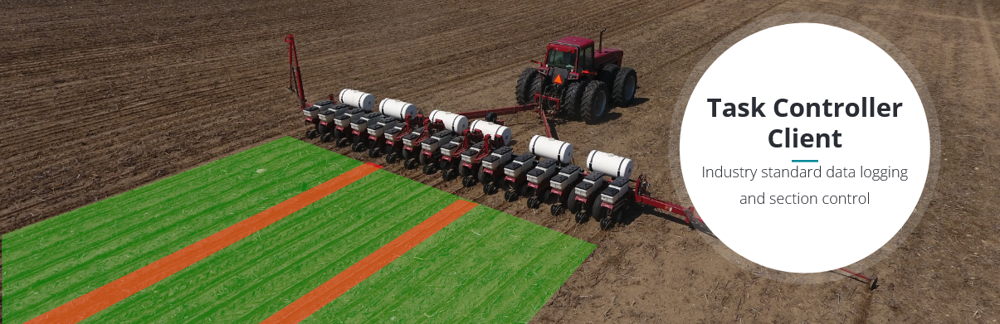

# AgIsoStack++ 🚜

— <ins>**Ag**</ins>riculture <ins>**ISO**</ins>-11783 <ins>**stack**</ins> for C<ins>**++**</ins>

*The completely free open-source ISOBUS library for everyone - from hobbyists to industry!*

[Documentation & Tutorials](https://agisostack-plus-plus.readthedocs.io/en/latest/index.html) | [Issues & Suggestions](https://github.com/Open-Agriculture/AgIsoStack-plus-plus/issues) | [Discussions](https://github.com/Open-Agriculture/AgIsoStack-plus-plus/discussions) | [Discord](https://discord.gg/uU2XMVUD4b) | [Telegram](https://t.me/+kzd4-9Je5bo1ZDg6)

> AgIsoStack++ simplifies implementing ISOBUS functionalities by providing a transparent and well-documented library. This allows you to concentrate on your application, without getting bogged down in rules defined by standards and guidelines.

- [Features](#features)
- [In Detail](#in-detail)
- [Getting Started](#getting-started)
- [Roadmap](#roadmap)
- [Community](#community)

## Features

- Platform independent C++ library
- Virtual Terminal Client (Universal Terminal)
- Auxiliary control (AUX-N)
- Task Controller Client and Server
- ISOBUS shortcut button (ISB)
- The complete backbone of the ISO11783 standard
- NMEA 2000 Fast Packet Protocol
- Common guidance and speed messages
- [Hardware drivers for many common CAN controllers](https://isobus-plus-plus.readthedocs.io/en/latest/api/hardware/index.html#choosing-a-can-driver-with-cmake)

## In Detail

ISOBUS (based on the ISO-11783 standard) defines how agricultural machinery should communicate with each other on a CANbus network. Cross compatibility is achieved when different manufacturers carefully follow this standard when developing their devices. This means that a tractor from one manufacturer can communicate with an implement from another manufacturer, and vice versa.

AgIsoStack++ provides an easy-to-use interface for your application to communicate on the ISOBUS network in a compliant manner, without the need to worry about the details of the standard.
The library is is written in modern C++11 and uses the STL whenever possible. It is designed to be easy to understand is fully documented.

## Getting Started

Check out the [tutorial website](https://agisostack-plus-plus.readthedocs.io/en/latest/) for information on ISOBUS basics, how to download this library, and how to use it. The tutorials contain in-depth examples and explanations to help get your ISOBUS or J1939 project going quickly.

### Use of our SAE/ISOBUS Manufacturer Code

If you are integrating with our library to create an ISO11783 or J1939 application and are not selling your software or device containing that software for-profit, then you are welcome to use our manufacturer number in your application.

If you are creating such an application for sale as a for-profit company, then we ask that you please obtain your own manufacturer code from SAE instead of using ours.

Our manufacturer code is 1407 (decimal).

## Roadmap

## Community

Join us on [Discord](https://discord.gg/uU2XMVUD4b) for support, to share your project, and good vibes in general! Alternatively, you can also join us on [Telegram](https://t.me/+kzd4-9Je5bo1ZDg6).

## Special Thanks

This project's sponsors are a big part of making this project successful. Their support helps fund new hardware and software tools to test against, which drives up quality.

Thank you:

- Franz Höpfinger [franz-ms-muc](https://github.com/franz-ms-muc)
- Balázs Gunics [gunicsba](https://github.com/gunicsba)
