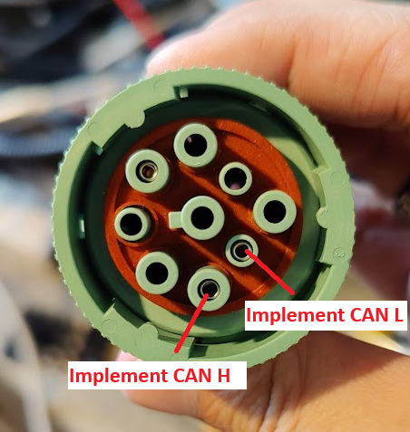

.. _UsingESP32WithPlatformIO:

Using ESP32 and PlatformIO
===========================

.. toctree::
   :hidden:
   :glob:

.. contents:: Contents
   :depth: 2
   :local:

This tutorial covers how to get started using the library with an ESP32 and PlatformIO. We'll cover setting up the tooling, creating a blank project, and running the VT client example.

Installation
--------------

#.  Install `Visual Studio Code. <https://code.visualstudio.com/download>`_
#.  Install `Git <https://git-scm.com/downloads>`_
#.  Install the PlatformIO Extension in VS Code

    .. image:: ../../images/install_platformio.png
        :width: 360
        :alt: Installing the PlatformIO extension

#.  Select the PlatformIO Extension and wait for it's installation to finish. This might take several minutes.
#.  Once PlatformIO is done installing, it might ask you to restart VS Code, or to reload it. Do this if it asks.

Everything you need should now be installed!

Getting Started With a Blank Project
-------------------------------------

To create a blank PlatformIO project that uses AgIsoStack, here are the basic steps.

#.  Open VS Code, select the PlatformIO extension, click "Create New Project", and/or "New Project"

    .. image:: ../../images/new_platformio_project.png
        :width: 420
        :alt: Creating a new Platform IO project

#.  Give your project a name, select your target ESP32 board, and make sure to select :code:`Espidf` as your framework.

    .. image:: ../../images/project_settings.png
        :width: 360
        :alt: Setting Platform IO project settings
      
#.  Wait while PlatformIO creates the project. This can take several minutes depending on how much data PlatformIO has to fetch from the internet.
#.  VS Code may ask you to trust your workspace once the project is created. Click "yes", and optionally consider checking the box to always trust your projects folder.

    .. image:: ../../images/vs_code_trust.png
        :width: 360
        :alt: Setting Platform IO project settings

#.  Now you've got a blank project, and you should be able to build it successfully at this point to test you've done everything correctly so far.

Now that you have a blank project, you can start adding the AgIsoStack library to it.
The AgIsoStack++ library is a C++ library, so we need to compile our main file as a C++ file instead of a C file.
Also, Since the ESP-IDF framework expects app_main to have C-linkage and we have changed to a C++ file, we need to add :code:`extern "C"` decoration, otherwise you will get a linker error when you build the project.

#.  Rename your :code:`main.c` file to :code:`main.cpp`.
#.  Change the definition for :code:`app_main` to be :code:`extern "C" void app_main()`.
#.  Add the following line to your :code:`platformio.ini` file: ::code:`lib_deps = https://github.com/Open-Agriculture/AgIsoStack-plus-plus.git`
   
    This will tell PlatformIO to reach out to GitHub, download the library, and automatically integrate it via CMake.

    .. warning::
		
        PlatformIO will not automatically update AgIsoStack. You can run :code:`pio pkg update` to update it manually from the PlatformIO core CLI.
        It is important that you do this from time to time to ensure you have the latest features and bug fixes.

#.  Optionally, add lines to your :code:`platformio.ini` file to allow the CAN stack to send logged errors and warning messages through the serial monitor, and to have backtraces parsed for you if your application crashes.

    .. code-block:: ini

        build_type = debug
        upload_protocol = esptool
        monitor_speed = 115200
        monitor_rts = 0
        monitor_dtr = 0
        monitor_filters = esp32_exception_decoder

    Your :code:`platformio.ini` file should end up looking something like this, though your board and environment may be different:

    .. code-block:: ini

        ; PlatformIO Project Configuration File
        ;
        ;   Build options: build flags, source filter
        ;   Upload options: custom upload port, speed and extra flags
        ;   Library options: dependencies, extra library storages
        ;   Advanced options: extra scripting
        ;
        ; Please visit documentation for the other options and examples
        ; https://docs.platformio.org/page/projectconf.html

        [env:denky32]
        platform = espressif32
        board = denky32
        framework = espidf

        lib_deps = https://github.com/Open-Agriculture/AgIsoStack-plus-plus.git

        build_type = debug
        upload_protocol = esptool
        monitor_speed = 115200
        monitor_rts = 0
        monitor_dtr = 0
        monitor_filters = esp32_exception_decoder

    Specifically, this configuration was created for the ESP-WROOM-32 (denky32), so if you have a different board, make sure to edit this appropriately.

#.  Include the header files you might need in :code:`main.cpp`.

    AgIsoStack++ is a somewhat large library. There are a lot of files, each separated by specific CAN or ISOBUS functionality. Check out the other tutorials, or the VT example below for what you might want to include.

    At an absolute minimum, you'll need these files to send or receive anything.

    .. code-block:: c++

        #include "isobus/hardware_integration/twai_plugin.hpp"
        #include "isobus/hardware_integration/can_hardware_interface.hpp"
        #include "isobus/isobus/can_network_manager.hpp"
        #include "isobus/isobus/can_partnered_control_function.hpp"

#.  Set up the ESP32's TWAI

    he ESP32 has what is essentially a built-in classic CAN 2.0 controller. Because of this, you can use the TWAI interface on your ESP32 instead of having to add a serial CAN controller like the MCP2515.

    .. note::
		
        You will still require a CAN transceiver `like this one <https://www.amazon.com/SN65HVD230-CAN-Board-Communication-Development/dp/B00KM6XMXO>`_ to convert the low voltage outputs of the TWAI controller to actual CAN signaling voltages.
        You cannot hook a CAN bus directly to the TWAI pins.

    Adding the following code will configure the TWAI.

    .. code-block:: c++
		
        extern "C" void app_main()
        {
            twai_general_config_t twaiConfig = TWAI_GENERAL_CONFIG_DEFAULT(GPIO_NUM_21, GPIO_NUM_22, TWAI_MODE_NORMAL);
            twai_timing_config_t twaiTiming = TWAI_TIMING_CONFIG_250KBITS();
            twai_filter_config_t twaiFilter = TWAI_FILTER_CONFIG_ACCEPT_ALL();
            std::shared_ptr<isobus::CANHardwarePlugin> canDriver = std::make_shared<isobus::TWAIPlugin>(&twaiConfig, &twaiTiming, &twaiFilter);
        }

    This code sets GPIO 21 and GPIO 22 to the be the TWAI transmit and receive pins respectively, and configures the default ISO11783/J1939 baud rate of 250k bits.
    It also ensures that all messages on the bus are passed through to the stack, and none are filtered out by the hardware.
    Lastly, it creates an instance of the AgIsoStack TWAI driver class, which will manage the TWAI for you.

    You do not need to choose these same GPIO pins, but these are known to work well.

#.  Set up our device's NAME, and start the CAN stack.

    This is boilerplate code that can be found in nearly every AgIsoStack project that sets up your device and starts the CAN stack, with slight modifications for ESP32.

    .. code-block:: c++

        #include "esp_log.h"
        #include "freertos/task.h"

        extern "C" void app_main()
        {
            twai_general_config_t twaiConfig = TWAI_GENERAL_CONFIG_DEFAULT(GPIO_NUM_21, GPIO_NUM_22, TWAI_MODE_NORMAL);
            twai_timing_config_t twaiTiming = TWAI_TIMING_CONFIG_250KBITS();
            twai_filter_config_t twaiFilter = TWAI_FILTER_CONFIG_ACCEPT_ALL();
            std::shared_ptr<isobus::CANHardwarePlugin> canDriver = std::make_shared<isobus::TWAIPlugin>(&twaiConfig, &twaiTiming, &twaiFilter);

            isobus::CANHardwareInterface::set_number_of_can_channels(1);
            isobus::CANHardwareInterface::assign_can_channel_frame_handler(0, canDriver);
            isobus::CANHardwareInterface::set_periodic_update_interval(10); // Default is 4ms, but we need to adjust this for default ESP32 tick rate of 100Hz

            if (!isobus::CANHardwareInterface::start() || !canDriver->get_is_valid())
            {
                ESP_LOGE("AgIsoStack", "Failed to start hardware interface, the CAN driver might be invalid");
            }

            isobus::NAME TestDeviceNAME(0);

            //! Consider customizing some of these fields, like the function code, to be representative of your device
            TestDeviceNAME.set_arbitrary_address_capable(true);
            TestDeviceNAME.set_industry_group(1);
            TestDeviceNAME.set_device_class(0);
            TestDeviceNAME.set_function_code(static_cast<std::uint8_t>(isobus::NAME::Function::RateControl));
            TestDeviceNAME.set_identity_number(2);
            TestDeviceNAME.set_ecu_instance(0);
            TestDeviceNAME.set_function_instance(0);
            TestDeviceNAME.set_device_class_instance(0);
            TestDeviceNAME.set_manufacturer_code(1407);
            auto TestInternalECU = isobus::CANNetworkManager::CANNetwork.create_internal_control_function(TestDeviceNAME, 0);

            while (true)
            {
                // CAN stack runs in other threads. Do nothing forever.
                vTaskDelay(10);
            }

            isobus::CANHardwareInterface::stop();
        }

	This is the absolute minimum for the stack to address claim for you, and for it to be ready to accept your messages.

#.  Set up your ESP32's OS and PThread options

    As mentioned before, AgIsoStack is a fairly large multi-threaded library, so we need to adjust some platform settings to allow the library to run smoothly. Not doing this will probably cause your device to repeatedly crash at runtime!
    More specifically, we need to adjust the default stack size, and the amount of stack allocated to the pthreads task.

    In PlatformIO, run `menuconfig` by either running :code:`pio run -t menuconfig` or by selecting the option from the PlatformIO extension.

    .. image:: ../../images/menuconfig.png
        :width: 400
        :alt: Running menuconfig

    .. warning::

        If you are experiencing an error running :code:`menuconfig`, you may need to comment out the following line(s) in your :code:`CMakeLists.txt` file inside the :code:`src/` folder if present. Make sure you un-comment the line once you are done with the menuconfig.
        
        :code:`target_add_binary_data(${COMPONENT_TARGET} "object_pool/object_pool.iop" BINARY)`

    Once menuconfig is running, navigate to :code:`Component config -> PThreads` and change the stack size of pthreads to 8192 bytes, this should prevent the stack from running out of memory. 
    If you still experience crashes, you may need to increase this value further.

    .. image:: ../../images/pthreads_settings.png
        :width: 500
        :alt: Running menuconfig

    Last, but not least, we have to increase the FreeRTOS tick rate **or** decrease the tick rate of the stack for them both to match. 
    For increasing tick rate of FreeRTOS, navigate to :code:`Component config -> FreeRTOS -> Kernel` and configure the :code:`configTICK_RATE_HZ`. We suggest to match the update period of the stack, which by default is 4ms. So a good value for :code:`configTICK_RATE_HZ` is 250Hz.

    .. image:: ../../images/tick_rate.png
        :width: 500
        :alt: Running menuconfig

    For decreasing the update rate of the stack, set the update period to your desired value in your init/main function: :code:`isobus::CANHardwareInterface::set_can_driver_update_period(10)` for 10ms update period. This matches the default FreeRTOS tick rate of 100Hz.

#.  Close the menuconfig by pressing :code:`Q` on your keyboard, followed by :code:`Y` to save your changes.
#.  Add your application code and build your project using the PlatformIO extension. That's it! You should now have a working AgIsoStack project on your ESP32.

If you made it this far, but you're not sure how to use the library to make a functional application yet, or you are having trouble compiling, check out the VT Client example in the next section, and be sure to read the other tutorials.

VT Client Example
------------------

To build and run a minimal, but interactive project that will load an ISOBUS object pool to a virtual terminal display, download the ESP32 PlatformIO example from our `GitHub repository <https://github.com/Open-Agriculture/AgIsoStack-plus-plus/tree/main/examples/virtual_terminal>`_ and copy all the ESP32 project's files into a blank PlatformIO project like the one we created earlier.

.. note::

    This example sets up the TWAI interface to run on GPIO 21 and 22. It does not require any external CAN controller, but does require a CAN transceiver `like this one <https://www.amazon.com/SN65HVD230-CAN-Board-Communication-Development/dp/B00KM6XMXO>`_.

.. note::
	
    The example's :code:`platformio.ini` file is configured for a WROOM/Denky-32 board, so you may need to edit it to match your board type.

.. note::

    To embed a binary file, like an object pool, into your project, you should use the :code:`target_add_binary_data` function in your :code:`CMakeLists.txt` file, as shown in the example `here <https://github.com/Open-Agriculture/AgIsoStack-plus-plus/blob/255fd580925e1d7d9baea1b16ad4ffcedf1fc974/examples/virtual_terminal/esp32_platformio_object_pool/src/CMakeLists.txt#L7>`_.
    Furthermore, in the :code:`platformio.ini` file, you should specify the file under :code:`board_build.embed_txtfiles` to embed the object pool into your binary, as shown in the example `here <https://github.com/Open-Agriculture/AgIsoStack-plus-plus/blob/255fd580925e1d7d9baea1b16ad4ffcedf1fc974/examples/virtual_terminal/esp32_platformio_object_pool/platformio.ini#L16`_.

    For more details about embedding files with ESP32 in combination with PlatformIO, see their documentation on `embedding binary data <https://docs.platformio.org/en/latest/platforms/espressif32.html#embedding-binary-data>`_.

The Wiring
^^^^^^^^^^^

In the example, we're using GPIO 21 and 22 to drive our CAN transceiver. In the following image, you can see an example of how you might connect your ESP32, CAN transceiver, and bus using this configuration.

In this case we're using a Deutsch DT 4 way plug to connect to the CAN bus, but the same can also be accomplished with a number of standard ISOBUS connectors such as this diagnostic connector:

Building and Running
^^^^^^^^^^^^^^^^^^^^^^

Once you have copied all of the example files into a project, set up your specific board, and properly connected your device, use platform IO to build the project, and flash it to your ESP32 device.

If everything is set up correctly, once programmed, the ESP32 will automatically load the example object pool to your ISOBUS display.

If nothing happens, use the serial monitor to look for error messages from the application. These messages may help you troubleshoot what is happening.

Going Beyond the Basics
------------------------

If you want to edit the VT example to run your own VT application, you will need to replace the object_pool.iop file with your own ISOBUS object pool, and you'll need to edit the example to handle the inputs and outputs inside that pool.

Check out the :doc:`Virtual Terminal Client Tutorial <Virtual Terminal Basics>` for more information on how to do that.

AgIsoStack has lots of other interfaces to make developing your own ISOBUS application on ESP32 easy, such as:

- Vehicle guidance and speed messaging
- ISO11783-10 Task Controller Client for implement section control and prescription maps
- ISOBUS Shortcut Button (ISB)
- Standard ISOBUS diagnostics

Take some time to review all the various header files in the library for protocols and technologies that are interesting to you!

If you would like to see more tutorials or have other feedback on this tutorial, please visit our `GitHub page <https://github.com/Open-Agriculture/AgIsoStack-plus-plus>`_ and feel free to open a discussion, or contribute to an existing discussion.
