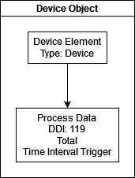
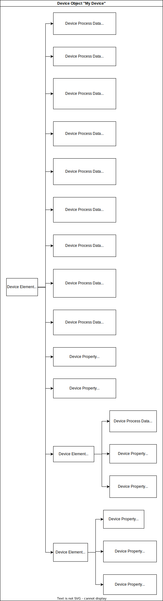

.. _TaskControllerBasics:

Task Controller Basics
=======================

.. toctree::
   :hidden:
   :glob:

.. contents:: Contents
   :depth: 2
   :local:

This tutorial will walk you through some basic ISOBUS Task Controller (TC) concepts, which will be important for understanding both the TC client and the TC server in this library.

Task Controller Overview
----------------------------

A Task Controller is a standard ISOBUS control function with its own complete part of the ISO11783 standard (ISO11783-10) that is used to log and control various implement functions.
The TC is responsible for managing task data, such as task boundaries, coverage maps, and status, as well as anything the implement wants logged with geospatial information.

Generally, this means that a TC:

- Uses geospatial data to plan and command an implement to execute a variable rate prescription task.
- Offers section control for the implement, to avoid applying product in areas that have already been covered.

Communication between the TC and the implement is done with a stateful protocol, where the TC sends commands to the implement, as well as requests for certain data it needs, and the implement sends back status updates.

AgIsoStack manages much of this communication for you, so you can focus on your business logic.

The Device Descriptor Object Pool (DDOP)
----------------------------------------

Much like how Virtual Terminal Clients use an object pool to tell a display what it should draw, an implement uses an object pool to describe to the TC what it is capable of doing. This object pool has different object types than a VT pool.
The DDOP is uploaded to the TC during the connection process of the implement to the TC.

In other words, the Device Descriptor Object Pool (DDOP) is a collection of objects that describe the capabilities of the implement, such as the number of sections, the width of each section, and the type of product being applied.
It is the authoritative source of implement geometry on the machine.

In AgIsoStack, if you use our TC client, you will have to create a DDOP that tells the TC about your implement.
Likewise, if you use the AgIsoStack TC Server, you will receive DDOPs from client implements, and you'll have to know what they mean.

Before we jump into some examples of well constructed DDOPs, let's go over some terminology first. Once you have some understanding of the things you can put in a DDOP, we'll show you how you can use AgIsoStack to easily create one.

Types of DDOP Objects
^^^^^^^^^^^^^^^^^^^^^^

A DDOP can contain only a few different types of objects, but they can be combined in many ways to describe in a fairly freeform way, all kinds of implements.

- **Device (DVC)**: This is the root object of the DDOP. It contains all the other objects. There can be only one of these in a DDOP, and it tells the TC about the implement as a whole. It contains the following fields:
    - Device Designator: A string that identifies the implement. Usually the name of the implement.
    - Device Software Version: A string that identifies the software version of the implement.
    - Device Serial Number: A string that identifies the serial number of the implement.
    - Device Structure Label: This is a unique identifier for a specific version of a DDOP. When the DDOP changes, this label should change, so that the TC client knows the TC has an outdated DDOP, and it will need to be re-loaded.
    - Device Localization Label: This is a specially formatted binary collection of bytes, which describe the language, country code, and unit systems used by the implement. This is used to ensure that the TC and the implement are using the same units and language.
    - Optionally, an Extended Structure Label: This is a TC version 4 optional field, which can be used to provide a longer structure label of up to 32 bytes. It can often be ignored.
- **Device Element (DET)**: These are used to build the logical description of the implement, and include things like sections, bins, and functions. Each of these helps to establish a hierarchy of booms, products, and sections. The different element types are:
    - Device: There is only one of these in a DDOP, and it describes the root of the element hierarchy.
    - Function: This element type can be used to define individually accessible components of a device, like valves, sensor, or booms.
    - Bin: This element type is used to define a container for a product, like a tank. Usually this element type is used as the root of objects that relate to the product in this bin. For example, a rate which has a parent of a bin, implies that rate is for the product in that bin.
    - Section: This element type is used to define a section of the implement, like a boom section. This element type is used as the parent of objects that provide information about the section, like the width of the section. There can be many sections in a DDOP.
    - Unit: This element type is, for example, used for spray boom nozzles, seeder openers, or planter row units.
    - Connector: This device element type specifies the mounting/connection position of the device.
    - NavigationReference: This defines the navigation reference position for devices such as GNSS receivers.
- **Device Process Data (DPD)**: This object is a "variable" in the DDOP, and is used to describe the current state of a device, like the current rate of a product, or the current status of a section. These are used to update the TC on the current state of the implement.
    - The value of a DPD is not stored in the DDOP, but is sent to the TC as a separate message, based on certain conditions.
    - This is the object type to use for anything that can change at runtime on the implement.
    - DPDs also tell the TC under what conditions they will be sent to the TC. For example, a DPD might be set to send a message to the TC whenever the rate changes by more than 1%, or every second, or every time the machine drives 1 meter. These are called measurement triggers.
    - DPDs also tell the TC if the value is a "total" value or not. For example, a rate is not a total value, but a total area covered is a total value.
- **Device Property (DPT)**: This object is used to describe a static property of a device, like the width of a section. These are used in conjunction with DPDs to describe the implement to the TC.
	- The value of a DPT is stored in the DDOP, and is sent to the TC when the DDOP is uploaded. It cannot be updated at runtime without re-uploading the DDOP.
	- This is the object type to use for anything that is fixed at the time the DDOP is created.
- **Device Value Presentation (DVP)**: This object is used to describe how a DPD should be displayed to the user.
    - This object contains information like the units, scale factor, offset, and number of decimals the TC should apply when showing a DPD or DPT to the user.
    - This object is optional, and if not present, the TC will use default values to display the DPD or DPT.

Additionally, each object has a unique ID, which is unique to that object, between 0 and 65534, which is used to distinguish between objects in the DDOP.

Together, these objects can be used to describe a wide variety of implements to the TC, and allow the TC to control and monitor the implement in a standardized way.

Data Dictionary Identifiers (DDIs)
^^^^^^^^^^^^^^^^^^^^^^^^^^^^^^^^^^

DPD and DPT objects in the DDOP use a number called a Data Dictionary Identifier (DDI) to identify the data they represent.

Basically, the DDI tells the TC what the data is, and how to interpret it.

The full list of all DDIs is managed by AEF, and are available on `isobus.net <https://www.isobus.net/isobus/dDEntity>`_.
AgIsoStack provides a `comprehensive list <https://github.com/Open-Agriculture/AgIsoStack-plus-plus/blob/main/isobus/include/isobus/isobus/isobus_standard_data_description_indices.hpp>`_ of DDIs for your convenience.

Let's look at DDI 134 as an example and see what it means.

DDI 134 is defined in the ISOBUS database on isobus.net as follows:

- DDI: 134
- Name: "Device Element Offset X"
- Definition: "X direction offset of a DeviceElement relative to a Device"
- Unit symbol: "mm"
- Bit Resolution: 1

This tells us that a DPT or DPD with DDI 134 can be used to describe the X direction offset of an element relative to the device reference point, and that the transmitted value is to be interpreted as millimeters.

In other words, if you have a section, for example, and a child DPT with this DDI under that section, that tells the TC that the value of that DPT is the section's X offset relative to the implement's device reference point.

You may be wondering, what's the device reference point? 
On a trailed implement, it would be the center of the front axle of the implement.
On a self-propelled rear-mounted implement, it would be the center of the rear axle of the implement.

.. note::

    The DDI list is a living document, and new DDIs are added as new features are added to the ISOBUS standard.
	It is important to check the latest version of the DDI list to ensure you are using the correct DDIs for your implement.

.. warning::

	Make sure you understand the link between a DDI and the DPT or DPD using it! If you are looking at an ISOBUS CAN trace, and are looking at the various DDIs being sent across the bus, you MUST know the entire structure of the DDOP to understand what the data means.
    For example, if you have an implement with 10 sections, each section may have a DPT with DDI 134, and each will likely have a different value. This means, in order to know what section any DDI 134 value is referring to, you must know the section's element number number, and other context from the DDOP.
    This means it is very difficult to sniff another devices' connection with the TC with any confidence in what the data means, unless you have the DDOP that was uploaded to the TC!

Creating DDOPs
--------------

Let's look at some examples of DDOPs, how they can be created to describe various implements, and how you can use AgIsoStack to create them.

The Simplest Example
^^^^^^^^^^^^^^^^^^^^

The absolute simplest TC-BAS DDOP you can create is this:

Clearly this DDOP doesn't do much, but it is a valid DDOP that can be uploaded to a TC.
It describes an implement with nothing which can be controlled, but does report the total time the implement has been active.

Here is the code to create this DDOP using AgIsoStack:

.. code-block:: c++

    #include "isobus/isobus/isobus_device_descriptor_object_pool.hpp"

    isobus::DeviceDescriptorObjectPool OurDDOP; // This creates a blank DDOP

    // We can use a LanguageCommandInterface to quickly generate a Localization Label.
    LanguageCommandInterface OurLanguageInterface(nullptr, nullptr);

    // Add a device object to the DDOP
    OurDDOP.add_device("My Device", "1.0.0", "123", "MIV1.0", OurLanguageInterface.get_localization_raw_data(), std::vector<std::uint8_t>(), 1234);
    OurDDOP.add_device_element("My Implement", 0, 0, task_controller_object::DeviceElementObject::Type::Device, 1);
    OurDDOP.add_device_process_data("Total Time", 119, 0xFFFF, 0, static_cast<std::uint8_t>(task_controller_object::DeviceProcessDataObject::AvailableTriggerMethods::Total), 2);

As you can see, we first create a blank DDOP, then add a device object, a device element, and a DPD to the DDOP.

The device object has a name/designator of "My Device", a software version of "1.0.0", a serial number of "123", a structure label of "MIV1.0", a localization label which is set to the defaults of all metric units, a blank extended structure label, and an ISO NAME of 1234. 
The device always has the object ID of 0 when using AgIsoStack.

The device element object has a designator of "My Implement", an element number of 0, a parent object ID of 0, a type of Device, and an object ID of 1.

The device process data object has a designator of "Total Time", a DDI of 119, a presentation object ID of 0xFFFF (which means it has no associated DVP object), no special properties (0), a trigger method of Total, and a unique object ID of 2.

In theory, you could now provide this DDOP to the AgIsoStack TC client, and it would upload it to the TC, and the TC would all this information about our fictional implement!

We'll cover use of the TC client in a later tutorial, but knowing how to create a DDOP is the first step to using it.

A One Product, One Section Seeder
^^^^^^^^^^^^^^^^^^^^^^^^^^^^^^^^^

Here's an example of what a DDOP might look like for a more complex implement, like a seeder with one product and one section. Notice how much more complex this DDOP is compared to the previous example.

The more complex an implement is, the more objects will be in the DDOP to accurately provide the TC with the information it needs to control and monitor the implement.

For DDOPs this complex, a good resource to refer to is `our seeder example <https://github.com/Open-Agriculture/AgIsoStack-plus-plus/blob/main/examples/seeder_example/section_control_implement_sim.cpp#L98>`_, which contains the code to create a more complex DDOP for a seeder.

AgIsoDDOPGenerator
^^^^^^^^^^^^^^^^^^

Open-Agriculture has created a tool called `AgIsoDDOPGenerator <https://github.com/Open-Agriculture/AgIsoDDOPGenerator>`_, which can help create, view, and edit binary DDOPs for your implements. Using this tool to view the heierarchies of DDOP objects can be very helpful in understanding how they are structured.

DDOPs created with AgIsoDDOPGenerator can be used with AgIsoStack, and can be uploaded to a TC using the AgIsoStack TC client.
