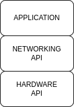

.. _ISOBUSHellowWorld:

The ISOBUS Hello World!
========================

.. toctree::
   :hidden:
   :glob:  

.. contents:: Contents
   :depth: 2
   :local:

In this tutorial, we'll demonstrate how to set up the library in a brand new C++ program and send a basic message to the broadcast address!

Let's get started by setting up a new C++ project to use this library.

We'll assume you followed the instructions in the :doc:`installation section <../Installation>`, so if you haven't, be sure to go back and check those instructions out.

We'll also assume you've reviewed the :doc:`concepts section <../Concepts>`, and are familiar with things like a NAME, and the idea of a control function.

This block diagram shows the basic components of an ISOBUS module. **Hardware API** handles the CAN transceiver driver and raw CAN frames. **Networking API** handles Control Functions for listening to data and sending to other modules, also transport protocols for handling of messages. The **Application** is where you will write your code to handle the data you receive and send.

First Steps
------------

Let's set up a standard, empty C++ program in a file called "main.cpp", and include the basic header files we'll need from the library to start using it.

.. code-block:: c++

   #include "isobus/isobus/can_network_manager.hpp"
   #include "isobus/hardware_integration/socket_can_interface.hpp"
   #include "isobus/hardware_integration/can_hardware_interface.hpp"
   #include "isobus/isobus/can_partnered_control_function.hpp"
   
   int main()
   {
   	return 0;
   }

The file `"can_network_manager.hpp" <https://delgrossoengineering.com/isobus-docs/can__network__manager_8hpp.html>`_ is the header file for the main interface for the CAN stack.

The file `"socket_can_interface.hpp" <https://delgrossoengineering.com/isobus-docs/socket__can__interface_8hpp>`_ is a hardware tie-in for socket CAN.

The file `"can_partnered_control_function.hpp" <https://delgrossoengineering.com/isobus-docs/can__partnered__control__function_8hpp.html>`_ Defines the interface for a *partnered control function*, which is another device you want to communicate with.

Tell the stack who you are (NAME)
----------------------------------

Before you can communicate on the CAN bus, you need to come up with a `NAME <https://delgrossoengineering.com/isobus-docs/classisobus_1_1NAME.html>`_.

A NAME is what uniquely identifies your device on the bus.

Check out the :doc:`concepts section <../Concepts>`, if you need to brush up on NAMEs.

Let's create a `NAME <https://delgrossoengineering.com/isobus-docs/classisobus_1_1NAME.html>`_ in our program.

.. note::
   Everything that is part of the stack is in the namespace `"isobus" <https://delgrossoengineering.com/isobus-docs/namespaceisobus.html>`_!

.. code-block:: c++

   #include "isobus/isobus/can_network_manager.hpp"
   #include "isobus/hardware_integration/socket_can_interface.hpp"
   #include "isobus/hardware_integration/can_hardware_interface.hpp"
   #include "isobus/isobus/can_partnered_control_function.hpp"
   
   int main()
   {
    isobus::NAME myNAME(0); // Create an empty NAME

    return 0;
   }

Now we have a NAME instantiated. We still need to populate it with our control function's details.

.. code-block:: c++

   #include "isobus/isobus/can_network_manager.hpp"
   #include "isobus/hardware_integration/socket_can_interface.hpp"
   #include "isobus/hardware_integration/can_hardware_interface.hpp"
   #include "isobus/isobus/can_partnered_control_function.hpp"
   
   int main()
   {
    isobus::NAME myNAME(0); // Create an empty NAME

    // Set up NAME fields
    myNAME.set_arbitrary_address_capable(true);
    myNAME.set_industry_group(1);
    myNAME.set_device_class(0);
    myNAME.set_function_code(static_cast<std::uint8_t>(isobus::NAME::Function::SteeringControl));
    myNAME.set_identity_number(2);
    myNAME.set_ecu_instance(0);
    myNAME.set_function_instance(0);
    myNAME.set_device_class_instance(0);
    myNAME.set_manufacturer_code(1407);

    return 0;
   }

So now, we have a NAME with actual information encoded in it. In this example, we are an on-highway steering controller, our serial number is 2, we support address arbitration, and we claim to be manufactured by manufacturer 1407 which is the Open-Agriculture manufacturer code.

Make sure to change these values to match your device's identity. Use `"isobus.net" <https://www.isobus.net/isobus/>`_ as a resource if you need to figure out all these values.\

As a note, some functions have been pre-defined for convenience, as you can see by the use of :code:`isobus::NAME::Function::SteeringControl` here, but you can use value defined in the standard.

Making an Internal Control Function
------------------------------------

Now that we have a NAME defined, we need to associate that NAME with a CAN channel on your device. This is so that the CAN stack can perform address claiming with your name!

In order to tell the CAN stack about our awesome NAME, we create an `"InternalControlFunction" <https://delgrossoengineering.com/isobus-docs/classisobus_1_1InternalControlFunction.html>`_. Think of this as the "source" of your messages. When you use this object later, it's what tells the CAN stack what NAME/address you want to send a message from.

In this example, I'll use a shared_ptr to store my InternalControlFunction, but you can use a regular concrete object, or a raw pointer, or whatever you like.

.. code-block:: c++

   #include "isobus/isobus/can_network_manager.hpp"
   #include "isobus/hardware_integration/socket_can_interface.hpp"
   #include "isobus/hardware_integration/can_hardware_interface.hpp"
   #include "isobus/isobus/can_partnered_control_function.hpp"

   #include <memory>
   
   int main()
   {
    isobus::NAME myNAME(0); // Create an empty NAME
    std::shared_ptr<isobus::InternalControlFunction> myECU = nullptr; // A pointer to hold our InternalControlFunction

    //! Consider customizing some of these fields, like the function code, to be representative of your device
    myNAME.set_arbitrary_address_capable(true);
    myNAME.set_industry_group(1);
    myNAME.set_device_class(0);
    myNAME.set_function_code(static_cast<std::uint8_t>(isobus::NAME::Function::SteeringControl));
    myNAME.set_identity_number(2);
    myNAME.set_ecu_instance(0);
    myNAME.set_function_instance(0);
    myNAME.set_device_class_instance(0);
    myNAME.set_manufacturer_code(1407);

    // Create our InternalControlFunction
    myECU = isobus::CANNetworkManager::CANNetwork.create_internal_control_function(myNAME, 0);

    return 0;
   }

In this example, I created my control function with a preferred address of 0x1C, and assigned it to CAN channel 0.

Now, we've got a little problem... What is CAN channel 0?

Let's set that up next!

Connecting the Stack to CAN Hardware
-------------------------------------

In this part of the tutorial, we will set up a socket CAN device to be CAN channel 0. We'll use "can0" as our socket CAN device.

If you've got a CAN adapter on your system, now would be a good time to make sure it's plugged in!

Open up a terminal and set up "can0" for an ISOBUS network (250k baud) and bring up the interface.

.. code-block:: bash

   sudo ip link set can0 up type can bitrate 250000

If this step fails, you may need to bring the interface down first, and then set it back to up.

.. code-block:: bash

   sudo ip link set can0 down
   sudo ip link set can0 up type can bitrate 250000

Now we'll add the connection between "can0" and the CAN stack to our program.

There are a few lines we'll need to add:

.. code-block:: c++

   std::shared_ptr<isobus::SocketCANInterface> canDriver = std::make_shared<isobus::SocketCANInterface>("can0");
   isobus::CANHardwareInterface::set_number_of_can_channels(1);
   isobus::CANHardwareInterface::assign_can_channel_frame_handler(0, canDriver);

   if ((!isobus::CANHardwareInterface::start()) || (!canDriver->get_is_valid()))
   {
      std::cout << "Failed to start hardware interface. The CAN driver might be invalid." << std::endl;
      return -1;
   }

The "CANHardwareInterface" is an independent component that is not actually directly tied to the CAN stack. It serves as a way for the stack to abstract away whatever hardware is being used.

So, lets talk about what's happening here.

:code:`std::shared_ptr<isobus::SocketCANInterface> canDriver = std::make_shared<isobus::SocketCANInterface>("can0");` Creates a new SocketCANInterface object, and stores it in a shared_ptr. This is the object that will be used to interface with the socket CAN driver.

:code:`isobus::CANHardwareInterface::set_number_of_can_channels(1)` Is telling the hardware layer (socket CAN in our case) that we will use 1 CAN adapter.

:code:`isobus::CANHardwareInterface::assign_can_channel_frame_handler(0, canDriver);` Tells the hardware layer that we want to use the SocketCANInterface object we just created as the handler for CAN channel 0.

:code:`isobus::CANHardwareInterface::start();` Kicks off a number of threads that will manage the socket and issue callbacks for when messages are received. It also provides callbacks to 'tick' the stack cyclically.
Checking its return value and :code:`get_is_valid` will tell you if the underlying CAN driver is connected to the hardware. In this case, since we're using socket CAN, it tells us if we bound to the socket.

Let's see what we've got so far:

.. code-block:: c++

   #include "isobus/isobus/can_network_manager.hpp"
   #include "isobus/hardware_integration/socket_can_interface.hpp"
   #include "isobus/hardware_integration/can_hardware_interface.hpp"
   #include "isobus/isobus/can_partnered_control_function.hpp"

   #include <memory>
   #include <iostream>

   int main()
   {
      isobus::NAME myNAME(0); // Create an empty NAME
      std::shared_ptr<isobus::InternalControlFunction> myECU = nullptr; // A pointer to hold our InternalControlFunction

      // Set up the hardware layer to use SocketCAN interface on channel "can0"
      std::shared_ptr<isobus::SocketCANInterface> canDriver = std::make_shared<isobus::SocketCANInterface>("can0");
      isobus::CANHardwareInterface::set_number_of_can_channels(1);
      isobus::CANHardwareInterface::assign_can_channel_frame_handler(0, canDriver);

      if ((!isobus::CANHardwareInterface::start()) || (!canDriver->get_is_valid()))
      {
         std::cout << "Failed to start hardware interface. The CAN driver might be invalid." << std::endl;
         return -2;
      }

      //! Consider customizing some of these fields, like the function code, to be representative of your device
      myNAME.set_arbitrary_address_capable(true);
      myNAME.set_industry_group(1);
      myNAME.set_device_class(0);
      myNAME.set_function_code(static_cast<std::uint8_t>(isobus::NAME::Function::SteeringControl));
      myNAME.set_identity_number(2);
      myNAME.set_ecu_instance(0);
      myNAME.set_function_instance(0);
      myNAME.set_device_class_instance(0);
      myNAME.set_manufacturer_code(1407);

      // Create our InternalControlFunction
      myECU = isobus::CANNetworkManager::CANNetwork.create_internal_control_function(myNAME, 0);

      return 0;
   }

Sweet! We're almost ready to send a message. Let's just add a few more things to make sure we gracefully stop the CAN stack when the program is done. This helps prevent memory leaks and crashing when exiting.

Cleaning up
------------

Whenever the program ends, we want to call :code:`isobus::CANHardwareInterface::stop();` to clean up the hardware layer and stop the threads we started with :code:`isobus::CANHardwareInterface::start();`.

Additionally, we want to exit if the user presses control+c (user sends a SIGINT signal to our program). So let's add a little signal handler that'll gracefully clean up if that happens.

Make sure to include the `csignal` and `atomic` headers. `csignal` is for handling signals, like control+c, and `atomic` is for handling the `running` flag, which we'll use to safely know when to exit.

.. code-block:: c++

   #include "isobus/isobus/can_network_manager.hpp"
   #include "isobus/hardware_integration/socket_can_interface.hpp"
   #include "isobus/hardware_integration/can_hardware_interface.hpp"
   #include "isobus/isobus/can_partnered_control_function.hpp"

   #include <atomic>
   #include <memory>
   #include <csignal>
   #include <iostream>

   // This helps us handle control+c and other requests to terminate the program
   static std::atomic_bool running = { true };
   
   void signal_handler(int)
   {
   	running = false;
   }

   int main()
   {
      isobus::NAME myNAME(0); // Create an empty NAME
      std::shared_ptr<isobus::InternalControlFunction> myECU = nullptr; // A pointer to hold our InternalControlFunction

      // Set up the hardware layer to use SocketCAN interface on channel "can0"
      std::shared_ptr<isobus::SocketCANInterface> canDriver = std::make_shared<isobus::SocketCANInterface>("can0");
      isobus::CANHardwareInterface::set_number_of_can_channels(1);
      isobus::CANHardwareInterface::assign_can_channel_frame_handler(0, canDriver);

      if ((!isobus::CANHardwareInterface::start()) || (!canDriver->get_is_valid()))
      {
         std::cout << "Failed to start hardware interface. The CAN driver might be invalid." << std::endl;
         return -2;
      }

      // Handle control+c
      std::signal(SIGINT, signal_handler);

      //! Consider customizing some of these fields, like the function code, to be representative of your device
      myNAME.set_arbitrary_address_capable(true);
      myNAME.set_industry_group(1);
      myNAME.set_device_class(0);
      myNAME.set_function_code(static_cast<std::uint8_t>(isobus::NAME::Function::SteeringControl));
      myNAME.set_identity_number(2);
      myNAME.set_ecu_instance(0);
      myNAME.set_function_instance(0);
      myNAME.set_device_class_instance(0);
      myNAME.set_manufacturer_code(1407);

      // Create our InternalControlFunction
      myECU = isobus::CANNetworkManager::CANNetwork.create_internal_control_function(myNAME, 0);

      // Clean up the threads
      isobus::CANHardwareInterface::stop();

      return 0;
   }

Hurry Up And Wait
------------------

One last thing before we send a message: address claiming takes time for the stack to complete. So, lets add a short delay to our :code:`main` thread that will allow us to wait till address claiming is done before doing anything.

.. code-block:: c++

   std::this_thread::sleep_for(std::chrono::milliseconds(1000));

The total result:

.. code-block:: c++

   #include "isobus/isobus/can_network_manager.hpp"
   #include "isobus/hardware_integration/socket_can_interface.hpp"
   #include "isobus/hardware_integration/can_hardware_interface.hpp"
   #include "isobus/isobus/can_partnered_control_function.hpp"

   #include <atomic>
   #include <memory>
   #include <csignal>
   #include <iostream>

   // This helps us handle control+c and other requests to terminate the program
   static std::atomic_bool running = { true };
   
   void signal_handler(int)
   {
   	running = false;
   }
   
   int main()
   {
    isobus::NAME myNAME(0); // Create an empty NAME
    std::shared_ptr<isobus::InternalControlFunction> myECU = nullptr; // A pointer to hold our InternalControlFunction

    // Set up the hardware layer to use SocketCAN interface on channel "can0"
    std::shared_ptr<isobus::SocketCANInterface> canDriver = std::make_shared<isobus::SocketCANInterface>("can0");
    isobus::CANHardwareInterface::set_number_of_can_channels(1);
    isobus::CANHardwareInterface::assign_can_channel_frame_handler(0, canDriver);

    if ((!isobus::CANHardwareInterface::start()) || (!canDriver->get_is_valid()))
    {
    	 std::cout << "Failed to start hardware interface. The CAN driver might be invalid." << std::endl;
    	 return -2;
    }

    // Handle control+c
    std::signal(SIGINT, signal_handler);

    //! Consider customizing some of these fields, like the function code, to be representative of your device
    myNAME.set_arbitrary_address_capable(true);
    myNAME.set_industry_group(1);
    myNAME.set_device_class(0);
    myNAME.set_function_code(static_cast<std::uint8_t>(isobus::NAME::Function::SteeringControl));
    myNAME.set_identity_number(2);
    myNAME.set_ecu_instance(0);
    myNAME.set_function_instance(0);
    myNAME.set_device_class_instance(0);
    myNAME.set_manufacturer_code(1407);

    // Create our InternalControlFunction
    myECU = isobus::CANNetworkManager::CANNetwork.create_internal_control_function(myNAME, 0);

    std::this_thread::sleep_for(std::chrono::milliseconds(1000));

    // Clean up the threads
    isobus::CANHardwareInterface::stop();

    return 0;
   }

Send a Message
---------------

Now, for the moment we've all been waiting for! Let's send a CAN message.

In this example, we'll send a proprietary A message (PGN 0xEF00) to the global/broadcast address (0xFF).

If you need to brush up on what a PGN is, check out the :doc:`concepts section <../Concepts>`.

The most basic way to send a CAN message is to call the :code:`send_can_message` function on the CANNetworkManager's interface.

Let's do that now! We'll create an 8 byte message, fill it with data, and send it.

Here is the code we'll need to add:

.. code-block:: c++

    std::array<std::uint8_t, isobus::CAN_DATA_LENGTH> messageData = {0}; // Data is just all zeros

   isobus::CANNetworkManager::CANNetwork.send_can_message(0xEF00, messageData.data(), isobus::CAN_DATA_LENGTH, myECU);

   // Give the CAN stack some time to send the message
   std::this_thread::sleep_for(std::chrono::milliseconds(10));

This will send our 8 byte message of all zeros to the global address, using the PGN for PROPA, (0xEF00). It will also wait a little bit before exiting so that we can be sure the message makes it to the bus. The wait time is arbitrary, and you will probably not need to wait in a normal program, but since ours will exit immediately without it, we want to make sure to give the CAN stack some time to process the message.

.. _complete_cmakelists:

Compiling The Program (Using CMake)
------------------------------------

Assuming you followed the :doc:`installation instructions <../Installation>` the program we just wrote should be in a folder, and the library should be in a directory called AgIsoStack-plus-plus, like this:

.. code-block:: bash

   ls
   AgIsoStack-plus-plus main.cpp

To get everything compiling into a program using CMake, let's add a CMakeLists.txt file.

Add the following to a new file called CMakeLists.txt:

.. code-block:: cmake

   cmake_minimum_required(VERSION 3.16)

   project(
     isobus_hello
     VERSION 1.0
     LANGUAGES CXX
     DESCRIPTION "ISOBUS Hello World Program"
   )
   
   set(THREADS_PREFER_PTHREAD_FLAG ON)
   find_package(Threads REQUIRED)
   
   add_subdirectory("AgIsoStack-plus-plus")
   
   add_executable(isobus_hello_world main.cpp)
   
   target_link_libraries(isobus_hello_world PRIVATE isobus::Isobus isobus::HardwareIntegration isobus::Utility Threads::Threads)

Save and close the file.

Configure the target using CMake:

.. code-block:: bash

   cmake -S . -B build

Then compile your program!

.. code-block:: bash

   cmake --build build

Then, assuming it all worked, you should be able to run your program like this:

.. code-block:: bash

   ./build/isobus_hello_world

Thats it! You are now talking on the bus!

See the more advanced tutorials to learn how to send destination specific messages, how to receive messages, how to use the transport layer, and more!

