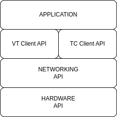

API Documentation
=================

This directory contains the official API documentation for the
AgIsoStack++ project.

.. toctree::
   :maxdepth: 2
   :glob:

   hardware/index
   network/index
   virtual terminal/index
   task controller/index
   implement messages/index

.. note::

   This documentation won't cover the complete API, but only the public
   parts of it. Which should be enough for most users.

   The internal parts are documented in the source code itself, and can
   be generated and viewed using Doxygen. More information about this
   can be found in the :ref:`doxygen` section.

An example use of **AgIsoStack++** might be to create an ISOBUS ECU that controls an implement, like a seed drill or sprayer. This ECU would implement a Hardware Interface with CAN, then set up a number of Control Functions: internal Control Function's to receive commands and some external Control Function's for commanding with other modules. 

The ECU would implement the Virtual Terminal (VT) client to send an Object Pool (IOP) file to a VT to display controls and information from the "screen in the tractor cab", and a Task Controller (TC) client to receive a tasking job. The rest of the Application would be the logic to control the implement based on the TC job and commands from the VT.
